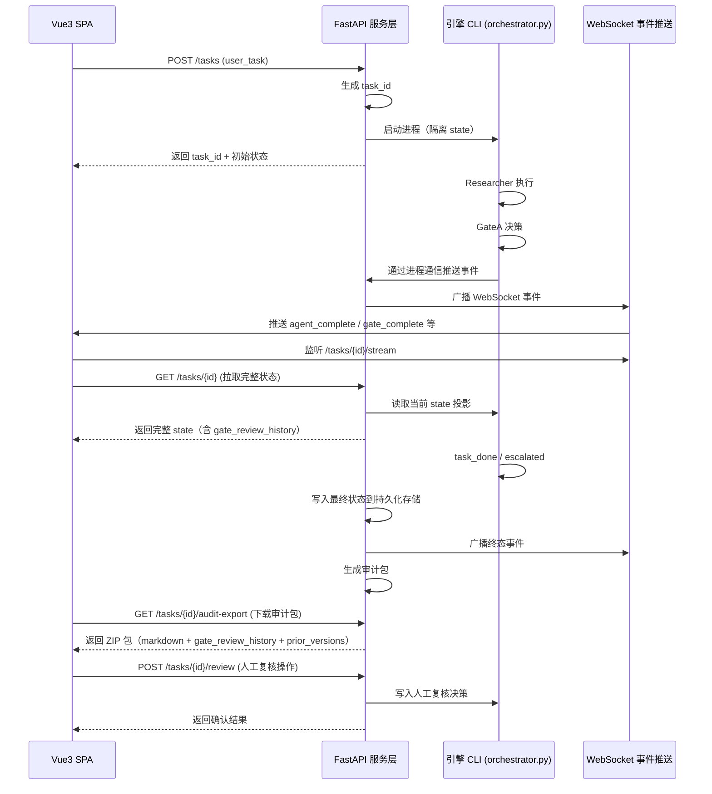

# API_SPEC · HTTP/WebSocket 服务层接口协议

> **状态**：M6 设计评审完成（M6-2~M6-6 已实现），版本 v1.0
> **纪律**：先出设计文档，不写代码。本文件评审通过前不落地任何 `*.py` 服务实现。
> **日期**：2026-09-05
> **依赖**：DESIGN.md v2.7（引擎层 schema 与契约）+ UIDESIGN.md v1.4（UI 层事件契约）

---

## 0. 元信息

| 项 | 值 |
|----|----|
| 项目名 | report-agent-team |
| 路径 | `E:\第二电脑\report-agent-team\` |
| 本文档范围 | HTTP/WebSocket 服务层接口协议（UI ↔ 引擎） |
| 技术栈 | FastAPI（REST）+ websockets（WebSocket）+ 事件流推送 |
| 部署方式 | 独立进程（与引擎 CLI `orchestrator.py` 解耦），支持多实例水平扩展 |

---

## 1. 架构总览（服务层 ↔ 引擎 ↔ UI）

服务层作为 UI 与 引擎 CLI 的隔离层，负责：

- 将用户提交的 `user_task` 转为引擎可执行调用；
- 将引擎的 LangGraph 状态流转转为 WebSocket 事件流；
- 提供 REST 接口供 UI 查询完整状态、下载审计包、发起人工复核；
- 支持多任务并发执行（每任务一个 engine 进程 / 隔离 state）。



---

## 2. REST 接口协议

### 2.1 任务提交

**接口**：`POST /tasks`

**请求体**：
```json
{
  "user_task": {
    "topic": "2026年AI芯片市场分析",
    "scope": ["市场概况", "供给端", "需求端", "竞争格局", "政策与风险"],
    "output_format_spec": "Markdown 格式，每节带引用链接，引用章节列出所有来源 ID 与 URL",
    "constraints": ["引用必须来自 2024-2026 年的权威来源"]
  }
}
```

**响应体**（201 Created）：
```json
{
  "task_id": "uuid-v4",
  "status": "running",
  "created_at": "2026-09-05T09:30:00Z",
  "user_task": { /* 原样回显 */ }
}
```

**错误响应**（400 Bad Request）：
```json
{
  "error": "INVALID_USER_TASK",
  "message": "scope 不可为空",
  "details": {}
}
```

---

### 2.2 结果拉取（完整状态投影）

**接口**：`GET /tasks/{task_id}`

**响应体**（200 OK）：
```json
{
  "task_id": "uuid-v4",
  "status": "running | done | escalated",
  "created_at": "2026-09-05T09:30:00Z",
  "updated_at": "2026-09-05T09:35:42Z",
  "user_task": { /* 原样 */ },
  "routing_state": {
    "round": 2,
    "max_rounds": 2,
    "last_gate": "GateB",
    "status": "running",
    "rework_target_agent": "Analyst",
    "rework_reason": "结论缺少素材支撑",
    "gate_review_history": [
      {
        "decision": "rework",
        "reason": "子问题覆盖不全",
        "eval_score": 0.4,
        "problem_points": ["缺'竞争格局'维度"],
        "gate": "GateA",
        "round": 1,
        "timestamp": "2026-09-05T09:32:15Z"
      }
    ],
    "engine_events": [
      {
        "event": "agent_output_unusable",
        "agent": "Writer",
        "reason": "LLM 调用失败（429）",
        "round": 2,
        "timestamp": "2026-09-05T09:34:20Z"
      }
    ]
  },
  "retrieval_records": [ /* 研究产出 */ ],
  "analysis_conclusions": [ /* 分析产出 */ ],
  "draft_segments": [ /* 撰稿产出 */ ],
  "tool_status": [ /* 工具调用结果 */ ],
  "prior_versions": { /* 产出快照 */ },
  "report_markdown": "完整研报内容（仅 status=done/escalated 时有）",
  "escalate_reason": "超过最大轮次限制（仅 status=escalated 时有）"
}
```

**状态投影规则**：
- **UI 不关心**：`PROD_KEY` 映射、`model_mapping.yaml`、工具实现细节；
- **UI 关心**：`routing_state` + 产出层 + `user_task`；
- **调试视图可展开**：`prior_versions`、`engine_events`、`gate_review_history`。

**错误响应**（404 Not Found）：
```json
{
  "error": "TASK_NOT_FOUND",
  "message": "任务不存在"
}
```

---

### 2.3 人工复核操作（escalate 后）

**接口**：`POST /tasks/{task_id}/review`

**请求体**：
```json
{
  "action": "confirm | retry | abort",
  "reviewer_comment": "人工复核意见",
  "rework_target_agent": "Analyst | Writer | null"  /* action=retry 时可选 */
}
```

**响应体**（200 OK）：
```json
{
  "task_id": "uuid-v4",
  "status": "done | running | aborted",
  "message": "复核已记录"
}
```

**业务规则**：
- 仅在 `status=escalated` 时可用；
- `action=confirm`：任务终态 `status=done`，生成审计包；
- `action=retry`：任务状态重置为 `running`，指定 `rework_target_agent`（可选）；
- `action=abort`：任务状态 `status=aborted`，不做任何修改。

**错误响应**：
- 409 Conflict：任务不在 `escalated` 状态；
- 400 Bad Request：`action` 不在可选列表。

---

### 2.4 审计包下载

**接口**：`GET /tasks/{task_id}/audit-export`

**响应体**（200 OK，`Content-Type: application/zip`）：
- ZIP 文件结构：
  ```
  audit-export-{task_id}.zip
  ├── report.md                          # 终稿 Markdown（report_markdown）
  ├── gate_review_history.json          # 完整 gate 审计链路
  ├── prior_versions.json                # 产出快照（每轮）
  ├── user_task.json                     # 原始任务
  └── engine_events.json                 # 引擎层事件留痕
  ```

**业务规则**：
- 仅在 `status=done | escalated | aborted` 时可用；
- ZIP 文件名包含 `task_id` 与时间戳（可选）：`audit-export-{task_id}-{timestamp}.zip`；
- 所有 JSON 文件均采用 UTF-8 编码，`ensure_ascii=false`。

**错误响应**：
- 404 Not Found：任务不存在；
- 409 Conflict：任务未完成（`status=running`）。

---

## 3. WebSocket 接口协议

### 3.1 连接建立

**端点**：`WS /tasks/{task_id}/stream`

**连接时参数**（可选）：
- `debug_mode=0 | 1`：调试模式开关（默认 0）；
  - 0：推送语义化叙事事件（业务可读）；
  - 1：推送原始事件（技术可读，含完整 state 片段）。

**连接认证**（可选）：
- 本实现可选 JWT / API Key 认证；
- 若未启用认证，任意客户端可连接（开发环境）；生产环境建议开启。

---

### 3.2 事件枚举与 Payload

以下事件与 UIDESIGN.md §5.2 的原始事件枚举对齐，payload 字段来自 DESIGN.md §7 的 schema。

#### 3.2.1 `agent_complete`（Agent 产出完成）

**触发**：Researcher / Analyst / Writer 执行完毕。

**Payload**：
```json
{
  "event_type": "agent_complete",
  "task_id": "uuid-v4",
  "timestamp": "2026-09-05T09:32:10Z",
  "round": 1,
  "agent": "Researcher | Analyst | Writer",
  "tool_status": [ /* 工具调用结果 */ ],
  "engine_events": [ /* 引擎层事件（本次执行内） */ ],
  "debug_state": { /* 仅 debug_mode=1 时推送：完整 state 片段 */ }
}
```

**UI 语义化文案**（`debug_mode=0`）：
- 🔍 调研完成（N 条素材）
- 📊 分析完成（M 条结论）
- 📝 撰稿完成

---

#### 3.2.2 `gate_complete`（Gate 决策完成）

**触发**：GateA / GateB / GateC 决策完成。

**Payload**：
```json
{
  "event_type": "gate_complete",
  "task_id": "uuid-v4",
  "timestamp": "2026-09-05T09:33:15Z",
  "round": 1,
  "gate": "GateA | GateB | GateC",
  "decision": "advance | rework | escalate",
  "reason": "子问题覆盖不全",
  "eval_score": 0.4,
  "problem_points": ["缺'竞争格局'维度"],
  "debug_state": { /* 仅 debug_mode=1 时推送：完整 state 片段 */ }
}
```

**UI 语义化文案**（`debug_mode=0`）：
- ✅ GateA 审核放行
- 🔁 被 GateA 打回：子问题覆盖不全
- ⛔ GateC 审判升级（业务严重问题）

---

#### 3.2.3 `rework_trigger`（返工触发）

**触发**：Router 决定 rework 后，调度 `rework_target_agent` 之前。

**Payload**：
```json
{
  "event_type": "rework_trigger",
  "task_id": "uuid-v4",
  "timestamp": "2026-09-05T09:33:20Z",
  "round": 2,
  "rework_target_agent": "Analyst",
  "rework_reason": "结论缺少素材支撑",
  "last_gate": "GateB",
  "debug_state": { /* 仅 debug_mode=1 时推送：完整 state 片段 */ }
}
```

**UI 语义化文案**（`debug_mode=0`）：
- ↩ 重新执行 Analyst

---

#### 3.2.4 `round_update`（轮次更新）

**触发**：Router 更新 `round` 时。

**Payload**：
```json
{
  "event_type": "round_update",
  "task_id": "uuid-v4",
  "timestamp": "2026-09-05T09:33:25Z",
  "round": 2,
  "max_rounds": 2,
  "debug_state": { /* 仅 debug_mode=1 时推送：完整 state 片段 */ }
}
```

**UI 语义化文案**（`debug_mode=0`）：
- 第 2 / 2 轮

---

#### 3.2.5 `tool_error`（工具调用异常）

**触发**：工具调用失败且 `ok=false` 写入 `tool_status` 时。

**Payload**：
```json
{
  "event_type": "tool_error",
  "task_id": "uuid-v4",
  "timestamp": "2026-09-05T09:32:05Z",
  "round": 1,
  "agent": "Researcher",
  "tool": "web_search",
  "error": "Tavily API key 缺失",
  "debug_state": { /* 仅 debug_mode=1 时推送：完整 state 片段 */ }
}
```

**UI 语义化文案**（`debug_mode=0`）：
- ⚠️ Researcher 工具 web_search 异常

---

#### 3.2.6 `task_done`（任务完成）

**触发**：GateC 决策 `advance`，终态 `status=done`。

**Payload**：
```json
{
  "event_type": "task_done",
  "task_id": "uuid-v4",
  "timestamp": "2026-09-05T09:35:40Z",
  "round": 1,
  "status": "done",
  "report_markdown": "完整研报内容（可选，完整内容可 GET /tasks/{id} 拉取）",
  "audit_url": "/tasks/{id}/audit-export",
  "debug_state": { /* 仅 debug_mode=1 时推送：完整 state 片段 */ }
}
```

**UI 语义化文案**（`debug_mode=0`）：
- 🎉 研报生成完成

---

#### 3.2.7 `task_escalated`（任务升级）

**触发**：Router 超限 `max_rounds` / Gate 判 `escalate`，终态 `status=escalated`。

**Payload**：
```json
{
  "event_type": "task_escalated",
  "task_id": "uuid-v4",
  "timestamp": "2026-09-05T09:36:10Z",
  "round": 2,
  "status": "escalated",
  "escalate_reason": "超过最大轮次限制",
  "last_gate": "GateC",
  "audit_url": "/tasks/{id}/audit-export",
  "debug_state": { /* 仅 debug_mode=1 时推送：完整 state 片段 */ }
}
```

**UI 语义化文案**（`debug_mode=0`）：
- ⛔ 已升级（需人工复核）

---

## 4. 状态投影 Schema（完整响应结构）

本节详细定义 `GET /tasks/{id}` 的响应结构，确保 UI 与 引擎契约一致。

### 4.1 顶层结构

```json
{
  "task_id": "uuid-v4",
  "status": "running | done | escalated | aborted",
  "created_at": "ISO8601",
  "updated_at": "ISO8601",
  "user_task": { /* 见 DESIGN §7 顶层任务 */ },
  "routing_state": { /* 见 DESIGN §7 路由状态 */ },
  "retrieval_records": [ /* 见 DESIGN §7 产出层 */ ],
  "analysis_conclusions": [ /* 见 DESIGN §7 产出层 */ ],
  "draft_segments": [ /* 见 DESIGN §7 产出层 */ ],
  "tool_status": [ /* 见 DESIGN §7 产出层 */ ],
  "prior_versions": { /* 见 DESIGN §7 产出层 */ },
  "report_markdown": "完整研报内容（仅 status=done/escalated 时有）",
  "escalate_reason": "超过最大轮次限制（仅 status=escalated 时有）"
}
```

### 4.2 `routing_state` 详细结构

```json
{
  "round": 2,
  "max_rounds": 2,
  "last_gate": "GateA | GateB | GateC | null",
  "status": "running | done | escalated",
  "rework_target_agent": "Researcher | Analyst | Writer | null",
  "rework_reason": "结论缺少素材支撑 | null",
  "gate_review_history": [
    {
      "decision": "advance | rework | escalate",
      "reason": "子问题覆盖不全",
      "eval_score": 0.4,
      "problem_points": ["缺'竞争格局'维度"],
      "gate": "GateA",
      "round": 1,
      "timestamp": "2026-09-05T09:32:15Z"
    }
  ],
  "engine_events": [
    {
      "event": "agent_output_unusable | writer_citation_regenerated | gate_llm_unavailable_degraded_advance",
      "agent": "Writer | null",
      "gate": "GateA | GateB | GateC | null",
      "reason": "LLM 调用失败（429）",
      "round": 2,
      "timestamp": "2026-09-05T09:34:20Z"
    }
  ]
}
```

### 4.3 产出层详细结构

#### `retrieval_records`
```json
[
  {
    "id": "rec-1",
    "url": "https://example.com/1",
    "title": "AI 芯片市场报告",
    "snippet": "2024 年全球 AI 芯片市场规模...",
    "credibility": "high | medium | low"
  }
]
```

#### `analysis_conclusions`
```json
[
  {
    "id": "con-1",
    "claim": "NVIDIA 仍主导 AI 芯片市场",
    "source_ids": ["rec-1", "rec-3"],
    "confidence": 0.85
  }
]
```

#### `draft_segments`
```json
[
  {
    "id": "seg-1",
    "section": "供给端",
    "content": "NVIDIA 仍主导市场...",
    "conclusion_ids": ["con-1", "con-2"]
  }
]
```

#### `tool_status`
```json
[
  {
    "agent": "Researcher",
    "tool": "web_search",
    "ok": true,
    "error": null
  },
  {
    "agent": "Writer",
    "tool": "doc_export",
    "ok": false,
    "error": "Markdown 写入失败"
  }
]
```

#### `prior_versions`
```json
{
  "researcher": [
    [ /* round 1 的 retrieval_records 完整快照 */ ],
    [ /* round 2 的 retrieval_records 完整快照 */ ]
  ],
  "analyst": [
    [ /* round 1 的 analysis_conclusions 完整快照 */ ]
  ],
  "writer": []
}
```

---

## 5. 审计导出格式

### 5.1 ZIP 包结构

```
audit-export-{task_id}-{timestamp}.zip
├── report.md                          # 终稿 Markdown
├── gate_review_history.json          # 完整 gate 审计链路
├── prior_versions.json                # 产出快照（每轮）
├── user_task.json                     # 原始任务
└── engine_events.json                 # 引擎层事件留痕
```

### 5.2 各文件内容

#### `report.md`
- 内容同 `GET /tasks/{id}` 的 `report_markdown` 字段；
- 包含完整的引用章节（id + url + 标题 + 可信度）。

#### `gate_review_history.json`
- 内容同 `GET /tasks/{id}` 的 `routing_state.gate_review_history` 字段；
- 保留完整的决策链路。

#### `prior_versions.json`
- 内容同 `GET /tasks/{id}` 的 `prior_versions` 字段；
- 记录每轮产出的完整快照。

#### `user_task.json`
- 内容同 `GET /tasks/{id}` 的 `user_task` 字段；
- 记录原始任务输入。

#### `engine_events.json`
- 内容同 `GET /tasks/{id}` 的 `routing_state.engine_events` 字段；
- 记录引擎层事件留痕。

---

## 6. 错误码与错误响应

| 错误码 | HTTP 状态 | 含义 | 常见原因 |
|--------|----------|------|----------|
| `INVALID_USER_TASK` | 400 | 用户任务参数非法 | `scope` 为空 / `topic` 缺失 |
| `TASK_NOT_FOUND` | 404 | 任务不存在 | `task_id` 无效 |
| `TASK_NOT_COMPLETED` | 409 | 任务未完成 | 在 `status=running` 时调用审计导出 |
| `TASK_NOT_ESCALATED` | 409 | 任务不在升级状态 | 在 `status≠escalated` 时调用人工复核 |
| `INVALID_REVIEW_ACTION` | 400 | 人工复核操作非法 | `action` 不在 `confirm | retry | abort` 内 |
| `INTERNAL_ERROR` | 500 | 内部服务错误 | 引擎进程崩溃 / 磁盘写失败 |

**错误响应格式**：
```json
{
  "error": "INVALID_USER_TASK",
  "message": "scope 不可为空",
  "details": {},
  "timestamp": "2026-09-05T09:30:00Z"
}
```

---

## 7. 安全与认证（可选）

### 7.1 认证方式（可选）

本实现可选以下认证方式之一：
- **JWT Bearer Token**：UI 携带 `Authorization: Bearer <token>`；
- **API Key**：UI 携带 `X-API-Key: <key>`；
- **无认证（开发环境）**：任意客户端可连接。

### 7.2 CORS 配置

- 允许 UI 域名（开发环境可设 `*`）；
- 允许方法：`GET`、`POST`；
- 允许头：`Content-Type`、`Authorization`、`X-API-Key`。

---

## 8. 性能与扩展性

### 8.1 并发任务

- 每任务一个独立引擎进程（隔离 state）；
- 支持多实例水平扩展（负载均衡）；
- 建议最大并发任务数：CPU 核心数 × 2。

### 8.2 状态持久化

- 运行时状态保存在内存（引擎进程内）；
- 终态状态写入持久化存储（PostgreSQL / Redis / SQLite）；
- 审计包生成后持久化到磁盘（可选 S3 对象存储）。

### 8.3 WebSocket 连接限制

- 单任务最多 10 个并发 WebSocket 连接（防止恶意连接）；
- 连接超时：5 分钟无心跳自动断开。

---

## 9. 里程碑

| 阶段 | 内容 | 产出 |
|------|------|------|
| M6-1 | API_SPEC 评审通过 | 本文件定稿 |
| M6-2 | FastAPI 服务层实现 | `server/main.py` + `server/api.py` + `server/websocket.py` |
| M6-3 | 引擎 CLI 封装 | `server/engine_client.py`（进程启动 / 状态查询） |
| M6-4 | 状态持久化集成 | PostgreSQL / Redis 集成 |
| M6-5 | 审计包生成 | `server/audit_export.py`（ZIP 打包） |
| M6-6 | 部署与测试 | Docker Compose / 本地测试 |

---

## 10. 依赖与前置条件

| 项 | 要求 |
|----|------|
| Python 版本 | ≥3.12 |
| 依赖包 | fastapi、uvicorn、websockets、pydantic、sqlalchemy（持久化） |
| 引擎 CLI | `orchestrator.py` 可独立执行（无需服务层） |
| 数据库（可选） | PostgreSQL 15+ / Redis 7+（状态持久化） |

---

## 11. 评审修订记录

- **草稿 v0.1（2026‑09‑05）**：首次起草。定义 HTTP/WebSocket 接口协议、WebSocket 事件 payload、状态投影 schema、审计导出格式；对齐 DESIGN v2.7 + UIDESIGN v1.4。