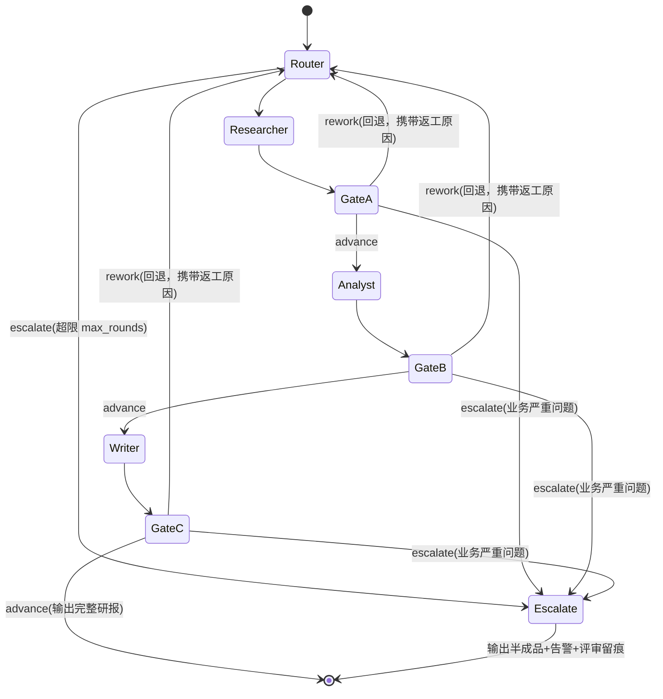

# DESIGN · 研报多 Agent 协作系统

> **状态**：v2.3 评估补全版（M1 正式锁版；采纳 v2.2 评估报告 5 补全项 + 设计方措辞修正；可进 M2）
> **纪律**：先出设计文档，不写代码。本文件评审通过前不落地任何 `*.py` 业务实现。
> **日期**：2026-09-04

---

## 0. 元信息

| 项 | 值 |
|----|----|
| 项目名 | report-agent-team |
| 路径 | `E:\第二电脑\report-agent-team\` |
| 编排框架 | **LangGraph**（Python） |
| 定位 | 独立的多 Agent 研报协作系统，不耦合 unified-inbox |
| 来源参考 | awesome-llm-apps（agent_teams / memory / self-improving-agent-skills）+ edict-gate 三道门禁 |

---

## 1. 目标与范围

**输入**：用户提交"研报业务任务"（结构化 `user_task`，见 §7）。
**输出**：带引用溯源的结构化 Markdown 研报 + 完整评审留痕。

**核心前提（已确认）**：
1. 独立项目，不与 unified-inbox 共享代码库。
2. 三 Agent 协作**必须带审核闸**，否则中间错误一路错到底。
3. 子 Agent 角色由**可复用提示词模板**定义，非硬编码。

**非目标（本版）**：不接入 unified-inbox 代码；未来仅以 MCP / API 形式可被其调用。

---

## 2. 架构总览（LangGraph 状态图）

路由群（Router）是**唯一收敛点**：所有 rework 不直接跳回 Agent，而是先回 Router，由 Router 读取返工原因、调度对应 Agent 重做，并统一维护全局轮次计数与超限判断。



**Router 职责（单一收敛）**：
- 维护 `routing_state.round` 全局轮次计数器；
- 接收 Gate 返回的 `gate_output`；按 `decision` 分支：`advance`→下一 Agent，`rework`→读取 `rework_reason` 调度 `rework_target_agent` 重做，`escalate`→超限或严重问题；
- 当本次 rework 会使 `round` 超过 `max_rounds` 时，直接输出 `escalate`，不交给 Agent 再跑。

**Escalate 产出（不空结束）**：`半成品内容 + 失败原因 + gate_review_history 评审留痕`，附告警。

> **职责边界澄清（来自 v2 复审）**：Gate 节点**只负责产出** `gate_output.decision`（含 `escalate` 标记），**不执行全局轮次计数**；`max_rounds` 超限判断一律由 Router 执行。逻辑上 Gate 仅识别业务层面的致命问题（如检索全空、编造引用），轮次超限是 Router 直接生成 `escalate`，不走 Gate 的业务判断——避免 Gate 与 Router 两处都写轮次逻辑造成双重来源。

---

## 3. 技术栈

| 层 | 选型 | 说明 |
|----|------|------|
| 编排 | LangGraph (Python) | rework 回退环是图原生能力 |
| LLM | 经 new-api 网关 | Claude / Gemini / GPT / DeepSeek 可切换，复用 failover；**角色→模型映射见 `config/model_mapping.yaml`，Gate 优先用异基座模型缓解自审包庇** |
| 记忆 | 进程内 state + 可选持久化 | 持久化可复用 unified-inbox 的 PostgreSQL/Redis 栈 |
| 工具 | web_search / data_proc / doc_export | 首版直连，后续可替换为 MCP |
| 门禁 | edict-gate 三道门禁范式 | 校验 → 自审 → 独立审议 |
| 评测 | self-improving-agent-skills 的 eval 思路 | 给每道闸打分（**辅助，非替代 Gate 业务规则**） |

---

## 4. 目录结构

```
report-agent-team/
├── DESIGN.md              # 本文件
├── agents/
│   ├── researcher.md      # 调研Agent角色模板
│   ├── analyst.md         # 分析Agent角色模板
│   └── writer.md          # 撰稿Agent角色模板
├── gates/
│   └── review.md          # 三道闸的审核 prompt + 判定规则
├── memory/
│   └── schema.md          # 共享记忆 schema 定义（user_task / 产出 / gate_output / routing_state）
├── tools/
│   ├── web_search.py      # 联网搜索（含失败处理）
│   ├── data_proc.py       # 数据处理/计算
│   └── doc_export.py      # Markdown 导出
├── config/
│   └── model_mapping.yaml  # 角色→模型映射（缓解同源自审包庇；M2 落地）
├── orchestrator.py        # LangGraph 图定义（M3 已完成：真实状态图 + rework 环 + JSON 容错 + 引用链机器校验；M4 工具已真实接入；M5 真网关跑通 status=done）
├── requirements.txt       # M3 依赖：langgraph / openai / pyyaml
└── tests/                 # M2+ 用途：prompt 测试、gate 用例、端到端样例测试；M3 起含 test_orchestrator.py（stub 场景，无需联网/密钥）
```

---

## 5. 角色 Prompt 模板（草稿）

> 约定：每个 `agents/*.md` 是编排器加载的配置，含 role / goal / tools / io / 硬约束。
> **通用硬约束（所有 Agent）**：若输入含 `rework_reason`，必须优先针对该问题点**定向修正**；rework 时**工作态全量替换**（返回完整修正后的数组，不原地 patch，旧值由引擎快照进 `prior_versions`），满足"可审计且无残留"；输出中须附带 `change_note` 说明针对哪条 rework 原因做了哪些改动（详见 §11-5 与 `memory/schema.md` §0-3）。

### agents/researcher.md
- **角色**：信息搜集员
- **目标**：围绕任务检索权威资料，产出带引用的素材集
- **工具**：`web_search`
- **输出**：检索记录数组 `[{id, url, title, snippet, credibility}]`
- **硬约束**：不得编造来源；低可信度须标注；覆盖 `user_task.scope` 全部子问题；工具失败须标记异常而非静默

### agents/analyst.md
- **角色**：业务分析师
- **目标**：基于调研素材生成观点与结论
- **工具**：`data_proc`
- **输入**：调研产出（**必须 cite**）
- **输出**：结论数组 `[{id, claim, source_ids[], confidence}]`
- **硬约束**：每条结论 `source_ids` 非空；不得引入素材外的断言；逻辑自洽；工具失败须标记异常

### agents/writer.md
- **角色**：报告撰写人
- **目标**：整合为结构化 Markdown 研报
- **工具**：`doc_export`
- **输入**：分析结论 + 调研素材
- **输出**：研报 Markdown（含独立"引用/来源"章节）
- **硬约束**：仅使用已通过闸的内容；保留全部引用 ID；工具失败须标记异常

---

## 6. 三道闸审查规则（gates/review.md）

每道闸执行 **校验 → 自审 → 独立审议**，写入结构化 `gate_output`（见 §7）到 state，Router 读取 `decision` 分支。

| 闸 | 位置 | 审查点 | rework 条件 | escalate 条件 |
|----|------|--------|-------------|---------------|
| **GateA** | 调研→分析 | 覆盖度、来源可信度、是否偏题 | 子问题未覆盖 / 来源不可信 / 偏离任务 | 业务严重问题（检索完全无有效素材）；**轮次超限由 Router 处理** |
| **GateB** | 分析→撰稿 | 结论是否都有素材支撑、逻辑自洽、无外部断言 | 出现无据结论 / 逻辑断裂 | 业务严重问题（大量编造引用）；**轮次超限由 Router 处理** |
| **GateC** | 终稿 | 整体一致性、格式、引用完整 | 引用缺失 / 与上游结论冲突 | 业务严重问题（报告完全不可用）；**轮次超限由 Router 处理** |

**轮次计数（全局）**：`routing_state.round` 由 Router 统一递增；`max_rounds`（建议 2–3）为全局阈值，到达即 `escalate`。可选：各闸可配子阈值用于告警，但终止判断只看全局 round。

**eval 边界**：eval 打分是 `gate_output.eval_score` 的辅助输入，**不替代** Gate 业务规则；Gate 业务规则优先，`eval_score` 仅作为触发 rework 的条件之一。

---

## 7. 共享记忆空间 Schema（memory/schema.md）

### 顶层任务
```yaml
user_task:
  topic: str               # 研报主题
  scope: list[str]         # 需覆盖的子问题
  output_format_spec: str  # 输出格式、引用规范
  constraints: list[str]   # 用户额外约束
```

### 产出层
| 键 | 结构 | 约束 |
|----|------|------|
| `retrieval_records` | `[{id, url, title, snippet, credibility}]` | researcher 写 |
| `analysis_conclusions` | `[{id, claim, source_ids[], confidence}]` | analyst 写，`source_ids` 非空 |
| `draft_segments` | `[{id, section, content, conclusion_ids[]}]` | writer 写，`conclusion_ids` 非空 |
| `tool_status` | `[{agent, tool, ok: bool, error?: str}]` | 工具调用结果，失败标记 `ok=false`；**每次 Agent 执行追加一条记录**，支持一个 Agent 调用多个工具的场景（数组可含同一 agent 的多条 tool 记录） |
| `prior_versions` | `{researcher: list[retrieval_records_snapshot], analyst: list[analysis_conclusions_snapshot], writer: list[draft_segments_snapshot]}` | 每次 rework 前的**完整产出快照**（每元素为一轮全量数组），仅用于审计；业务链路只读取顶层最新字段，不消费本项（M2 `memory/schema.md` 展开） |

### Gate 输出（结构化，Router 解析依据）
```yaml
gate_output:
  decision: advance | rework | escalate
  reason: str                    # 可读评审理由
  eval_score: float [0-1]        # 来自 self-improving-agent-skills 评估器（辅助）
  problem_points: list[str]      # 具体问题点，作为 rework_reason 喂给 Agent
```

### 路由状态（单一收敛）
```yaml
routing_state:
  round: int                     # 全局总执行轮次（Router 递增；首跑 = 1，每次 rework +1）
  max_rounds: int                # 全局最大执行轮次阈值（默认 2 ⇒ 最多 1 次 rework）
  last_gate: "GateA|GateB|GateC"
  status: "running|done|escalated"
  rework_target_agent: str|null  # 需返工的 Agent：Researcher/Analyst/Writer
  rework_reason: str|null        # 来自 gate_output.reason/problem_points，透传给 Agent
  gate_review_history: list[gate_output]  # 每次闸门结果追加，交付时附完整审计
  engine_events: list[engine_event]      # 引擎层事件留痕（Agent 产出不可用：LLM 失败/JSON 崩坏/产出为空），仅审计；不混入 gate_review_history（详见 memory/schema.md §4.1）
```
> `gate_eval_scores` 不单列，分数已含于 `gate_review_history` 各条 `gate_output.eval_score`，审计一条链路搞定。

**引用强制链**：`writer` 段 → `conclusion_ids` → `analyst` 结论 → `source_ids` → `researcher` 检索记录。任一环断裂即判 `rework`。

**工具失败流**：`tool_status.ok=false` → 该 Agent 产出标记异常 → 进入 Gate 校验 → Gate 据严重度判 `rework` 或 `escalate`，**不静默崩溃**。

---

## 8. 与 edict-gate 集成点

- 三道闸 = edict-gate 三道门禁的**运行时实例**（校验 → 自审 → 独立审议）。
- 独立审议留痕复用 `VERIFICATION.md` / `REVIEW.md` 机制，每次研报交付可审计（`gate_review_history` 即留痕载体）。
- 未来：本系统作为 edict-gate 治理的子流程，交付自动过门禁；`self-improving-agent-skills` 的 eval 给闸打分迭代。

---

## 9. 里程碑

| 阶段 | 内容 | 产出 |
|------|------|------|
| M1 | DESIGN 评审通过 | 本文件 v2 定稿 |
| M2 | 角色 + 闸 prompt 定稿 | `agents/*.md` + `gates/review.md` + `memory/schema.md` |
| M3 | LangGraph 图实现 | ✅ **已完成**：`orchestrator.py` 真实状态图 + rework 环 + JSON 容错 + 引用链机器校验 + `tests/test_orchestrator.py`（6 用例全绿）；工具层留 M4 桩 |
| M4 | 工具接入 | ✅ **已完成**：`tools/web_search.py`(Tavily+Mock 降级) / `data_proc.py`(AST 白名单安全求值) / `doc_export.py`(引用章节确定性重建)；`tests/` 全 25 用例全绿 |
| M5 | 端到端跑通 | ✅ **已完成**：真 new-api 网关端到端 `status=done`（三闸全 advance）；`run_real.py` + `NewApiLLMClient`(retry/backoff+预检+120s 超时)。⚠️ 内容为 Mock 检索占位，真实调研需 `TAVILY_API_KEY` |
| M6（可选） | 接 edict-gate / 暴露 MCP | 可被 unified-inbox 调用 |

**M6 MCP 契约（前置）**：输入 `user_task` 结构化参数；输出 `完整研报 markdown + 溯源引用列表 + gate_review_history 审计记录`。

---

## 10. 风险与约束

| 风险 | 缓解 |
|------|------|
| 无限 rework 死循环 | 全局 `max_rounds` 由 Router 统一管控，超限 `escalate` |
| 工具失败静默崩溃 | `tool_status` 标记异常 → Gate 判定 rework/escalate |
| 大模型编造引用 | 引用强制链 + GateB 查 `source_ids` 非空 + `credibility` 标注 |
| 引用链断裂 | 任一环 `source_ids`/`conclusion_ids` 为空即判 rework |
| eval 被当成唯一判定 | 明确 eval 仅辅助，Gate 业务规则优先 |
| rework 重复犯同样错 | `rework_reason` 透传 + Agent 定向增量修正约束 |
| **同源模型自我确认偏差**（来自桌面评审） | Gate 与产出 Agent 错开基座模型（`model_mapping.yaml`）；代码层结构化硬校验优先于 LLM 主观判断；Gate 不接收产出 Agent 私有推理链；**独立重检索抽样核验引用（`verify_citation`，M6 增强，M2–M5 暂靠前两项）** |
| **eval 调用自身失败**（429 / 超时） | eval 降级为"无分，仅业务规则"；eval 失败 ≠ gate 失败 |
| **rework 全量重生成 token 成本上涨**（Q5 代价） | 默认 `max_rounds=2` 严格限制轮次；M6 再评估安全增量方案 |
| **多 Agent + 多 Gate 并发限流 / 配额抢占** | role→model 映射天然分散负载；Gate 调用串行化 / 限流；new-api `RetryTimes` 兜底故障转移 |

> **免责提示**：所有 LLM 输出仍存在幻觉可能；`gate_review_history` 审计留痕仅辅助人工核查，不证明产出事实 100% 正确。

---

## 11. 开放问题（已决策，M2 执行基线）

> 决策来源：桌面评审建议（2026-09-04）+ 设计方复核修订。以下为编写 `agents/*.md` / `gates/review.md` / `memory/schema.md` 的约束基线。

1. **LLM 调用**：采用 new-api 网关（首版强制）；密钥 / 失败转移 / 负载由网关处理。
   - **强约束（设计方新增，已并入 Q1）**：项目维护 `config/model_mapping.yaml` 完成【角色→模型】映射，**审核闸 Gate 优先分配与产出 Agent 不同基座的模型**，缓解同源自我确认偏差；Agent / Gate 的 Prompt 文本一律不绑定模型名。
   - 直连作为未来备选，本版不实现。
2. **搜索工具**：底层实现选用 Tavily；`tools/web_search.py` 做抽象层，预留未来替换 MCP 搜索；`agents/researcher.md` 仅依赖工具输出字段契约（id / url / title / snippet / credibility），不硬编码 Tavily 专有名词。
3. **记忆持久化**：M2–M5 原型用进程内内存 state；schema 兼容 LangGraph Checkpointer，M6 再接 PostgreSQL / Redis；任务完成 / escalate 支持导出完整审计 JSON 兜底。
4. **rework 轮次与阈值**：
   - `round` 语义（设计方修订，已对齐 §7）：**全局总执行轮次**，首跑 = 1，每次 rework +1；`max_rounds=2` 即最多 1 次 rework（round 2 后若再需 rework 直接 escalate）；阈值可由配置文件 / 运行参数调整（系统 M6 前无 UI，生产环境调高需评估 token 开销）。
   - `eval_score` 仅辅助，**M2 不设硬性分数阈值**；rework 完全由 Gate 业务规则驱动；阈值待 M5 跑通样例后校准写入配置。
5. **增量修改策略（设计方修订，偏离原建议，待 boss 否决）**：
   - **工作态（下游消费）一律全量替换**：Agent 每次 rework 返回**完整修正后的数组**，不原地 patch；结构上杜绝"旧错误条目残留在数组"的脚枪。
   - **历史版本单独归档**（`prior_versions[agent]`）仅用于审计，下游 Agent 不消费。
   - 原建议"优先增量修正不覆盖"已弃用——增量 patch 是 stale-error 根因；全量替换 + 历史归档同时满足"可审计"与"无残留"。

---

## 12. M2 写 prompt 落地铁律（来自 v2 复审，写代码前必读）

> 设计已覆盖，但 prompt 落地时极易踩坑；M2 写 `agents/*.md` / `gates/review.md` 时须作为硬约束：

1. **Agent 输出强制结构化 JSON 数组**：`retrieval_records` / `analysis_conclusions` / `draft_segments` 必须输出机器可解析的 JSON 数组，**禁止自由文本**，否则 LangGraph 解析 state 失败。
2. **Gate 输出强制完整 `gate_output`**：Gate prompt 必须强制输出完整 `gate_output` JSON 结构体（decision/reason/eval_score/problem_points），**禁止只输出自然语言评审**，否则 Router 无法读取 decision 与 problem_points。
3. **引用链机器可校验**：GateB 须做可程序校验的检查——`source_ids` 非空，且每个 id 必须存在于 `retrieval_records`；不能只靠大模型主观判断"看起来有引用"。
4. **rework 改动可复核**：当 `rework_reason` 传入 Agent，Agent 输出除修改后的业务数据外，还需输出一小段**改动说明**，供 Gate 再次复核定向修正是否到位。
5. **Gate 信息隔离（抗自审包庇）**：Gate 只接收产出 Agent 的**最终结构化产出 + 校验标准**，不接收其私有推理链（CoT / scratchpad）；避免被上游论证锚定。可选：`verify_citation` 工具让 Gate 独立重检索抽样核验引用真实性。
6. **eval 失败降级**：eval 本身是大模型调用，会遇 429 / 超时；eval 失败不得阻断 Gate，降级为"无分，仅业务规则判定"。
7. **M2 须配最小冒烟测试**：每个 Agent / Gate prompt 写完后，用 `tests/` 跑一次样例 `user_task`，断言 JSON 可解析、`gate_output` 字段齐全，避免 M3 才暴露 prompt 缺陷。

---

## 13. 评审修订记录

- **v1 → v2（2026-09-04）**：采纳评审意见修订——
  - 状态图改为 rework 全部回 Router 中转，轮次/告警单点收敛；补充 Escalate 产出定义。
  - `routing_state` 扩充 `rework_target_agent` / `rework_reason` / `gate_review_history`；轮次改为全局计数。
  - 三 Agent 模板补充"接收 `rework_reason` 定向增量修正"硬约束。
  - 新增 `gate_output` 结构化 schema；新增 `user_task` / `tool_status` schema；工具失败流入 Gate。
  - eval 边界澄清（辅助非替代）；补【风险与约束】节；M6 MCP 契约前置；新增开放问题 5。

- **v2 → v2.1（2026-09-04，v2 复审微调）**：采纳复审 🟡 5 条 + 🚨 M2 落地铁律——
  - 架构总览补职责边界澄清：Gate 只产 `decision=escalate` 标记，**全局轮次超限判断由 Router 执行**，Gate 不写轮次逻辑。
  - `tool_status` schema 补注：每次 Agent 执行追加一条记录，支持一个 Agent 多工具。
  - 三道闸 escalate 条件收紧：去掉"或超轮次"，改为"业务严重问题；轮次超限由 Router 处理"，消除双重轮次来源。
  - 开放问题 5 追加增量模式风险提示：Gate 须完整扫描全量数组，不能只看新增部分。
  - 目录 `tests/` 补用途注释。
  - 新增 §12「M2 写 prompt 落地铁律」四条（Agent/Gate 强制 JSON、GateB 引用链机器校验、rework 改动说明），固化 🚨 隐藏坑。

- **v2.1 → v2.2（2026-09-04，桌面评审决策 + 设计方复核）**：采纳 §11 五问决策建议，并作设计方修订——
  - §11 五问全部决策：new-api 网关（并入 role→model 映射强约束）、Tavily+抽象层、进程内 state、max_rounds=2（**修正 round 语义=总执行轮次，对齐 §7**）、eval 不设硬阈值。
  - 状态图修正：Gate→Escalate 边标签去"超限"，改 `Router --> Escalate : escalate(超限 max_rounds)`，彻底消除 v2 复审 🟡① 的图/文矛盾。
  - §10 风险表新增两条：同源模型自我确认偏差（错开基座+代码硬校验优先+Gate 独立重检索+信息隔离）、eval 调用自身失败降级。
  - §12 新增 M2 铁律 5（Gate 信息隔离抗包庇）、6（eval 失败降级）。
  - **设计方偏离原建议**：Q5 弃用"优先增量修正"，改为"工作态全量替换 + 历史单独归档"，根除 stale-error 脚枪（原建议正是上一轮 🟡③ 警告的风险源）。待 boss 否决。

- **v2.2 → v2.3（2026-09-04，v2.2 评估报告补全 + 设计方措辞修正）**：采纳评估报告 5 补全项，并作落盘时机与措辞修正——
  - §4 目录补 `config/model_mapping.yaml`（设计级，原报告归 M2 补全，现并入设计文档单一真相源）。
  - §7 共享记忆 schema 补 `prior_versions` 设计级字段（每轮完整产出快照列表，仅审计；记号修正为 `list[..._snapshot]`，非单条记录列表）；M2 `memory/schema.md` 展开。
  - §10 风险表补 3 项：rework 全量重生成 token 成本上涨、多 Agent+多 Gate 并发限流/配额抢占；**回写 `verify_citation` 为 M6 增强**（M2–M5 缓解=模型错开+代码硬校验+信息隔离），纠正原措辞高估；新增「免责提示」段。
  - §11.4 `max_rounds` 调整注释改「配置文件/运行参数」，**去掉"UI 高级模式"误述**（系统 M6 前无 UI）。
  - §12 新增 M2 铁律 7：每个 prompt 写毕用 `tests/` 跑最小冒烟测试（断言 JSON 可解析、gate_output 字段齐全）。

- **v2.3 → v2.4（2026‑09‑04，M3 实现回写）**：M3 `orchestrator.py` 落地后，将实现事实与设计偏差回写设计文档，防止文档与代码漂移——
  - §4 目录补 `requirements.txt`；`orchestrator.py` 描述由"仅类型桩"改为"已实现（真实状态图 + rework 环 + JSON 容错）"，并注明**工具层仍为桩、M4 接入**。
  - §7 `routing_state` 新增 `engine_events` 字段（引擎层审计，仅审计；不混入 `gate_review_history`，展开见 `memory/schema.md` §4.1）。**新增理由**：Agent 重试成功后 `rework_reason` 会被清空，若不留痕则"崩坏过几次、因何崩坏"彻底丢失，与系统可审计目标冲突。
  - §9 里程碑 M3 标记 ✅ 已完成。
  - **实现期发现并修正的两处缺陷（已修）**：① JSON 修复须按"括号出现位置最早"选取候选，否则 `前缀 [{"id":"rec-1"}] 后缀` 会被截成内层对象而丢失数组语义；② 按 §2 状态图 GateC 的 advance 直达 END，不经过 Router，故 `status="done"` 必须在 Gate 节点内落定（Router 内该分支为不可达死代码，已清理为防御性分支）。

- **v2.4 → v2.5（2026‑09‑04，M4 工具接入回写）**：M4 `tools/*.py` 真实接入后回写设计文档，防止文档与代码漂移——
  - §4 目录补 `config/tools.yaml`；`orchestrator.py` 描述由"工具层仍为桩"改为"工具真实接入"。
  - §7 `tool_status` 描述修正为**由引擎写入**（M4 前 Agent 输出自带 `tool_status` 属"假工具调用"，已废弃）。
  - §9 里程碑 M4 标记 ✅ 已完成；并补 M4 关键设计：**检索由引擎预取 + 来源溯源硬校验**，从根上根治 DESIGN §10「大模型编造引用」。
  - §10 风险表强化「大模型编造引用」的缓解（引擎真实检索 + 双重溯源硬校验）。
  - **实现期发现并修正的 2 处真缺陷（已修）**：① Writer 引用章节原由模型自由撰写，会漏写或写入编造 url（如 `example.com/supply`）→ 改用 `doc_export.ensure_citation_section` 确定性重建，并记 `engine_events.writer_citation_regenerated` 审计；② Gate 代码硬校验返回 `escalate` 时被 LLM 的 `advance` 覆盖（优先级反转）→ 修正为「代码 escalate > 代码 rework > LLM 判定」。

- **v2.5 → v2.6（2026‑09‑04，M5 网关接线回写）**：M5 真实网关接线落地，回写设计文档防止漂移——
  - `NewApiLLMClient` 补 **retry/backoff（指数退避，应对 new-api 生产环境频繁 429/掉线）** + **`preflight()` 连通性预检 + 模型列表校验**（验证 `model_mapping.yaml` 模型名是否在网关可用列表）。
  - 新增 `run_real.py` 真实模式运行器（网关/密钥经 `NEWAPI_BASE_URL`/`NEWAPI_API_KEY` 注入，不硬编码；结果落盘 `outputs/real_run_*.json` 审计）；`orchestrator.py __main__` 支持 `MODE=real` 切换。
  - **实测结论（2026‑09‑04）**：向 `localhost:3000/v1` 发了真实 HTTP 请求，网关返回 **503 服务不可用** → 编排器将 LLM 失败转 rework → 触顶 `max_rounds=2` → **escalate（优雅降级，无崩溃、无伪造终稿）**，并落盘审计。证明"真实网关接入 + 故障容错路径"已闭环；**唯独成功终稿待网关真正可用（new-api 启动且上游模型就绪）后复跑**。

- **v2.6 → v2.7（2026‑09‑04，M5 真实终稿闭环 + 5 处实现缺陷回写）**：真网关端到端跑通 **`status=done`**，回写设计文档防止漂移——
  - **M5 闭环实证**：真实网关（new-api `localhost:3000/v1`）全链路跑通，GateA `advance`(eval 0.95) → Analyst → GateB `advance`(0.95) → Writer → GateC `advance`(0.9，代码硬校验通过)；产出 `retrieval_records=13 / analysis_conclusions=9 / draft_segments=5`，终稿落盘 `outputs/2026_年_AI_芯片市场研报-20260904-231723.md`。§9 里程碑 M5 标记 ✅ 已完成。
  - **⚠️ 边界声明**：本轮未配 `TAVILY_API_KEY`，检索降级为 MockProvider（url 为 `mock.local`）。故验证的是**编排 / 三道闸 / 引用链 / 故障容错**，**非真实调研内容**；出真实研报须补 Tavily key。
  - **实现期发现并修正的 5 处真缺陷（已修）**：
    1. **下游 Agent 未注入上游 state**（根因级）：`make_agent` 只给 Researcher 注入了检索结果，`Analyst` 从未收到 `retrieval_records`、`Writer` 未收到 `analysis_conclusions` ⇒ 二者照 prompt 模板示例凭空编造引用 id（`rec-2/rec-3`），被 GateB 机器校验抓住并 escalate。已按 role 注入对应上游产出（只含可引用字段，控 token）。**这与角色模板 §3「输入」契约一致——是代码漏了接线，非设计缺陷。**
    2. **GateC 评估输入错位**：`build_gate_user` 只喂 `draft_segments`（结构化段本无引用章节），看不到 `doc_export` 已确定性重建的 `report_markdown` ⇒ Gate LLM 反复误判"缺引用 / 来源章节"。已补喂 `report_markdown`。
    3. **无请求超时（卡死 21 分钟）**：`NewApiLLMClient` 未设 `timeout`，OpenAI SDK 默认 600s/次，慢/假死上游无限挂起。已收紧为 **120s**（client init + create 调用），`run_real.py` 支持 `NEWAPI_TIMEOUT`。
    4. **潜伏 NameError ×2**：① `orchestrator.py` 的 `except ToolError` 未导入 `ToolError`（仅 doc_export 写盘抛错时触发）；② `doc_export.ensure_citation_section` 中 `section` 仅在 `if m:` 内定义却在分支外引用（无引用标题时崩）。均已修。
    5. **引用章节判定过松**：`ensure_citation_section` 只查 id 文本，LLM 输出的裸 id 列表（`- rec-6`）被误判"完整"而不重建 ⇒ 终稿引用缺 url、不可点击回溯。新增 `_citation_incomplete()`，**要求 id 与 url 同时出现**。
  - **闸门规则两条扩展**（已同步 `gates/review.md` §0 铁律 7/8、§4、§5）：
    - 判定优先级补全为 **代码 `escalate` > 代码 `rework` > 代码 `advance` > LLM 判定**（新增"代码判达标 ⇒ 强制放行"，因引用章节系 `doc_export` 代码所有项，不允许 LLM 主观误杀）。
    - **闸 LLM 不可用 ⇒ 降级放行 + 审计**：Gate LLM 最多解析 3 次仍失败时，若代码硬校验已通过则 `advance` 并记 `engine_events.gate_llm_unavailable_degraded_advance`；若代码判 `rework`/`escalate` 则照代码结论。依据：LLM 闸是**建议性**质量判断，代码硬校验才是权威——把网关瞬断抖动升级为整任务失败属假阴性误杀。
  - **上游健康度实测快照（运维约束）**：`config/model_mapping.yaml` 注释记录——siliconflow(deepseek/qwen) `do_request_failed`、google/gemini free-tier 限 20 次已耗尽(429)、`gemini-pro-latest` 429；可用为 custom/LongCat-2.0、zhipu/glm-4.7、cloudflare/llama-3.3-70b。**且 llama 不按 schema 出 `draft_segments`，Writer 须用强 schema 跟随模型（glm-4.7 / LongCat-2.0）。**
  - 根因：本机 new-api 网关当前未就绪（Docker Desktop 未随机启动 → 容器未起，正应证用户记忆「Docker 面板服务开机访问不了」头号根因）；sandbox 内亦无法拉起 Docker daemon。

## 14. Constitution Check

本设计遵循 `E:\第二电脑\CONSTITUTION.md` v1.0.0 以下原则：

- **I. 先设计后实现**：本文件 v2.7 评审通过前未写任何业务代码（M1→M5 事实已按此执行）。
- **II. 提交时三道闸**：每轮 Agent 产出经 GateA/B/C 校验→自审→独立审议，`gate_review_history` 即留痕。
- **III. 独立审议不可代签**：Gate LLM 遇 429/不可用时降级为代码硬校验 + 审计标记（`engine_events.gate_llm_unavailable_degraded_advance`），不伪造审议结果。
- **IV. 持续对齐**：每 round Agent 产出与 spec 比对（converge 设计见 GOVERNANCE_UPGRADE.md §3），覆盖缺口/引用断裂/未实现项自动生成 gap_tasks 作为 rework_reason 透传。
- **V. 最小依赖 + 安全文件操作**：工具层函数最小依赖（Tavily + langgraph + openai + pyyaml），`doc_export` 文件写入确定性重建 + hash 追踪，路径校验 + symlink 拒绝。

---

_设计稿 v2.7 · M1 正式锁版 · M2 已完成 · M3 已实现 · M4 已接入 · M5 真实终稿已闭环（status=done）· 内容待补 Tavily key 转真实检索_
